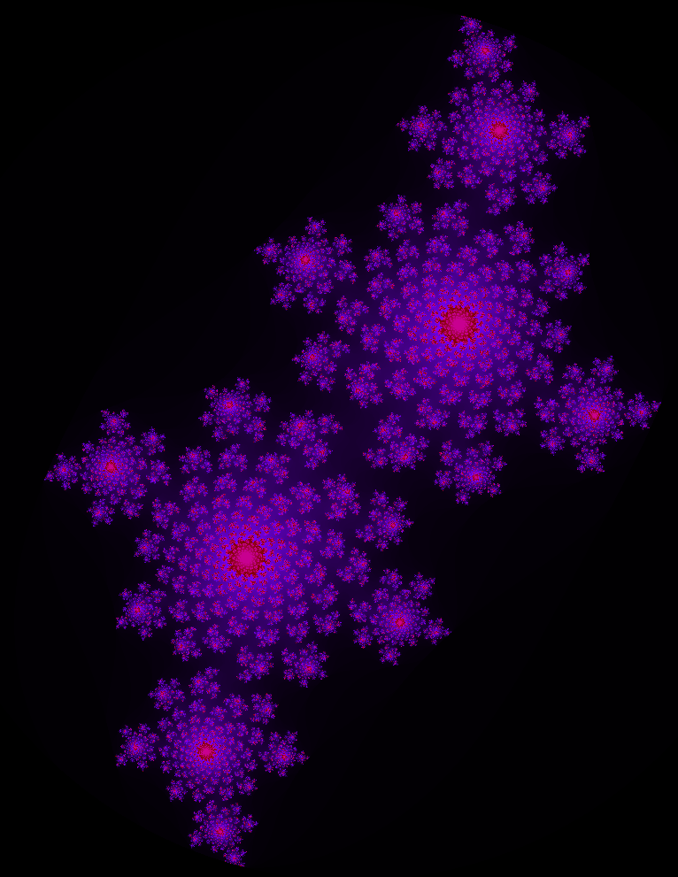

# Mandelbrot Fractal Generator

## Overview

This project is a Mandelbrot fractal generator implemented in CUDA and visualized using the raylib library. The Mandelbrot set is a fascinating mathematical structure, and this program allows you to explore and visualize it in real-time.



## Features

- GPU acceleration using CUDA for efficient fractal computation.
- Real-time rendering of the Mandelbrot set with adjustable zoom and pan.

## Dependencies

- NVIDIA GPU with CUDA support.
- raylib library.


## How to Build and Run

1. Clone the repository:

    ```bash
    git clone https://github.com/ElliotArn/Fractal.git
    ```

2. Navigate to the project directory:

    ```bash
    cd Fractal/src/
    ```

3. Compile the project with nvcc:

    ```bash
    nvcc fractal.cu -o fractal.out -lraylib -lGL -lm  -lX11
    ```

4. Run the executable:

    ```bash
    ./fractal.out
    ```

## Usage

- Left-click to zoom in.
- Right-click to zoom out.
- The zoom is a bit weird.

## Performance

The program achieves approximately 4.7 frames per second (FPS) during real-time rendering on a GeForce RTX 3050 Mobile.


## Acknowledgments

- This project utilizes the raylib library (https://www.raylib.com/) for graphical rendering. 
